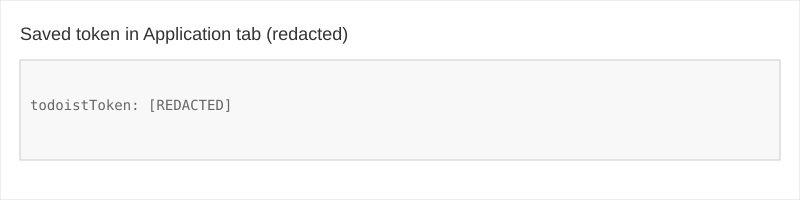
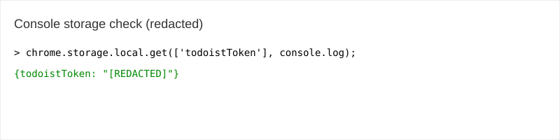

# Todo Date

## 日本語

Chrome/Edge の拡張機能で、現在のタブのタイトルと URL を Todoist に日付付きで送信します。

もともと、Todoist にはブラウザ用拡張機能があるが、それは多機能で簡単では無かった。ブラウザを見ていて、拡張機能のボタンを押して、日付を選んだらそのままクリックで動作するものを作ってみた。

### セットアップ

1. 拡張機能を Chrome/Edge でアンパックされた拡張機能として読み込みます。
2. ポップアップを開いて Todoist API トークンを入力します。
3. 「Save Token」をクリックしてから「Post to Todoist」をクリックします。

## English

A Chrome/Edge extension that posts the current tab title and URL to Todoist with a selected due date.
もともと、Todoist にはブラウザ用拡張機能があるが、それは多機能で簡単では無かった。ブラウザを見ていて、拡張機能のボタンを押して、日付を選んだらそのままクリックで動作するものを作ってみた。

## Setup

1. Load the extension in Chrome/Edge as an unpacked extension.
2. Open the popup and enter your Todoist API token.
3. Click "Save Token" and then "Post to Todoist".

## Notes

- The token is stored locally in the browser using `chrome.storage.local`.
- Do not commit any real API token to GitHub.
- To inspect the saved token, open the extension popup, open DevTools, and run:
  ```js
  chrome.storage.local.get(['todoistToken'], console.log);
  ```
  If `chrome.storage.local` is unavailable, you can also check:
  ```js
  localStorage.getItem('todoistToken')
  ```

## How I verified token storage (conversation notes)

During development I verified where the token is stored and how to view it in the browser. Steps I used and recommended:

- Open the extension popup (click the extension icon and open `todo_date`).
- Open the popup's DevTools via right-click → `Inspect`, or from `chrome://extensions/` use **Inspect views → popup**.
- In DevTools you can:
  - Check under the **Application** tab → **Storage** → **Local storage** → `chrome-extension://<extension-id>` and look for the `todoistToken` key.
  - Or run in the popup console:
    ```js
    chrome.storage.local.get(['todoistToken'], console.log);
    ```

If you see a warning about pasting code in the console, type `allow pasting` first and press Enter, then paste the command.

### Screenshot (paste your screenshots into `screenshots/` and commit them)

Below are placeholders — place actual screenshots at the indicated paths so they render in this README.

Saved token in Application tab:



Console showing storage check:



If you want, I can commit these screenshots to the repo if you provide the image files or confirm I should create placeholder files.

