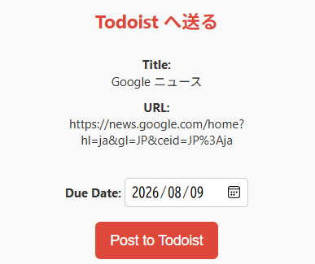
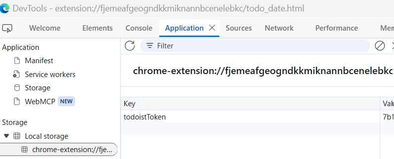

# Todo Date

## 概要

  
Todo Date は、Chrome/Edge の拡張機能で、現在のタブのタイトルと URL を Todoist に日付付きで送信する。
もともと、Todoist にはブラウザ用拡張機能があるが、それは多機能で簡単ではなかった。ブラウザを見ていて、拡張機能のボタンを押して、日付を選んだらそのままクリックで動作するものを作成した。

### セットアップ／使い方

1. GitHub からリポジトリをダウンロードまたはクローンする。
   - ダウンロードの場合: このリポジトリのページで「Code」→「Download ZIP」を選び、展開する。
   - クローンの場合: `git clone https://github.com/makoto0119/todo_date.git`
2. Chrome または Edge で `chrome://extensions/` を開く。
3. 右上の「デベロッパーモード」を有効にし、「パッケージ化されていない拡張機能を読み込む」をクリックする。
4. ダウンロード先のフォルダ（`todo_date`）を選択して読み込む。
5. 初回のみポップアップを開くと Todoist API トークンの入力が求められる。詳しくは Todoist 側のヘルプを参照する。
6. 次回以降は期限（日付）を必要に応じて変更し、「Post to Todoist」をクリックすると、選択した期限付きで Todoist にタスクが登録される。
7. 詳細手順は以下のページを参照する:
   - [Chrome – ローカルの拡張機能をインストールする方法 | 設定Lab](https://setup-lab.net/chrome-extended-local-install/#google_vignette)
8. トークンはブラウザのローカルに `chrome.storage.local` を使って保存している。

## トークン保存の確認方法

もし、登録済みの token の中身を確認したり削除したい場合は、以下の手順で。
- 拡張機能のポップアップを開く（`todo_date` を開いて、画面右クリック→「開発者ツールで調査する」）。
- DevTools では次のことができる:
  - **Application** タブ → **Storage** → **Local storage** → `chrome-extension://<extension-id>` を確認し、`todoistToken` キーを探す。

  